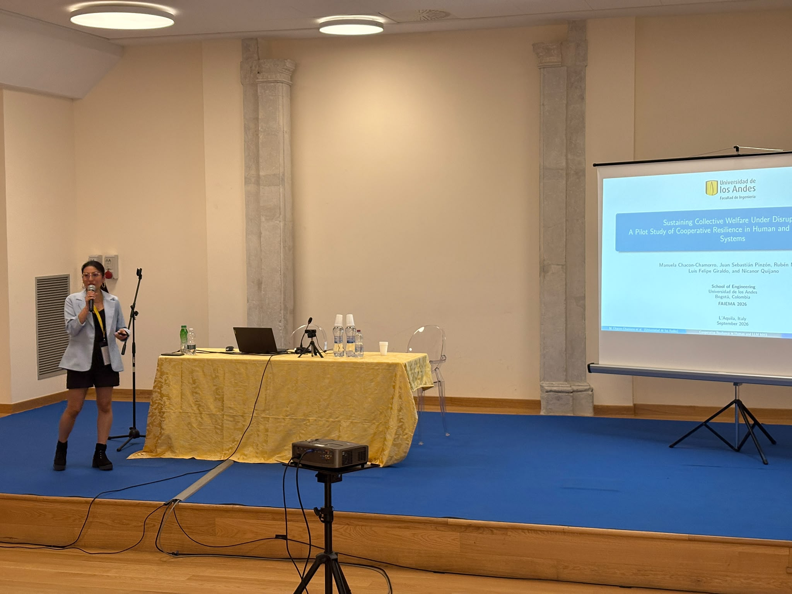
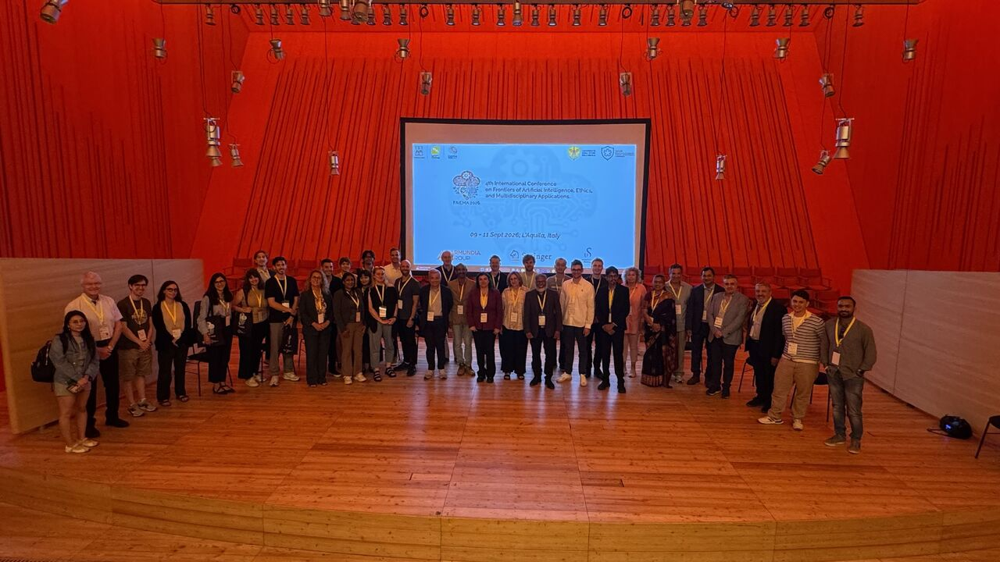

## ✨ About the talk

At FAIEMA 2026, I presented our work **“Sustaining Collective Welfare Under Disruption: A Pilot Study of Cooperative Resilience in Human and LLM Multi-Agent Systems.”** This research was developed jointly with Juan Sebastián Pinzón, Rubén Manrique, Luis Felipe Giraldo, and Nicanor Quijano at Universidad de los Andes.

The study explores how human groups and LLM-based multi-agent systems respond when cooperation is challenged by environmental and behavioral disruptions. Both populations interacted in the same mixed-motive social dilemma, following a shared experimental and evaluation protocol.

*Presenting our work on cooperative resilience in human and LLM-based multi-agent systems.*

## 🔎 Main findings

Our results showed that human groups sustained higher levels of cooperative resilience across the evaluated scenarios. Human participants tended to regulate their use of shared resources and maintain collective welfare more effectively under disruption.

In contrast, LLM-based agents showed more limited adaptation and tended toward higher resource consumption. Communication improved their performance in some scenarios, but it did not fully close the resilience gap between human and LLM-based groups.

These findings highlight the importance of evaluating AI agents not only under stable conditions, but also before, during, and after adverse events.

## 🌍 The conference experience

Participating in FAIEMA 2026 was a very rewarding experience. I had the opportunity to share our research with people from different institutions and research backgrounds, receive thoughtful questions, and exchange ideas about cooperative AI, multi-agent systems, resilience, and the societal implications of artificial intelligence.

Beyond the presentation itself, the conference created a welcoming environment for meeting other researchers and learning about work across different areas of AI. Sharing the conference activities and dinner with so many people made the experience especially enjoyable and memorable.

*Sharing ideas and experiences with other participants during FAIEMA 2026.*

## 💭 Final reflection

Presenting this work in L’Aquila was particularly meaningful because it brought together several dimensions of my doctoral research: defining cooperative resilience, studying collective behavior under disruption, and comparing the capabilities of humans and artificial agents.

The experience also reminded me that conferences are not only spaces for presenting results. They are opportunities to discuss unfinished questions, receive new perspectives, build connections, and recognize how research grows through interaction with others.