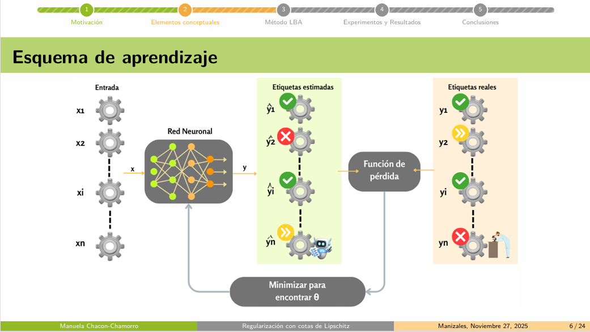
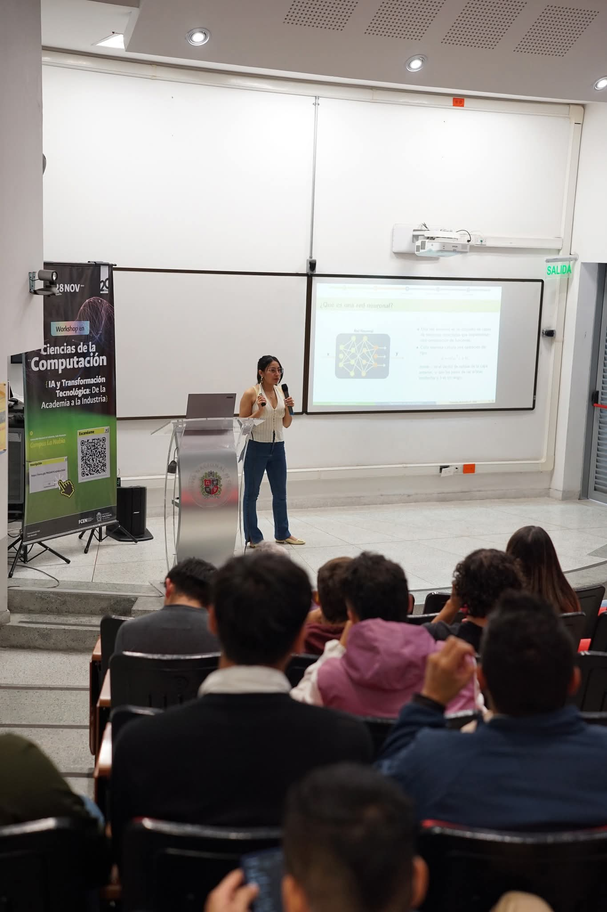

### ✨ Summary

In this talk, I presented my master’s research, which focuses on addressing overfitting in deep neural networks through an adaptive regularization strategy based on Lipschitz Bounds Adaptation (LBA). This work is grounded in our research paper, which provides the theoretical foundation and experimental validation of the proposed method [(paper on LBA)](/publications/jcam-2025/).

The motivation behind this work stems from the tendency of deep neural networks to overfit training data, capturing spurious patterns that negatively affect generalization. The LBA approach mitigates this issue by adaptively controlling the sensitivity of the model to input perturbations via Lipschitz bounds. Through experiments on image and tabular datasets, the method consistently reduces the training–validation gap while preserving competitive performance, and it also exhibits solid robustness against adversarial attacks.

During the talk, I discussed the theoretical foundations of overfitting, detailed the proposed LBA method, and presented experimental results alongside an introduction to adversarial attacks, concluding with potential directions for future research. The support received throughout the talk was excellent, and returning to the university to present my master’s work was a genuinely meaningful and rewarding experience.

  

    
  

  

    
  

  <a class="poster-button" href="slides.pdf" target="_blank">📄 View Full Slides (PDF)</a>

