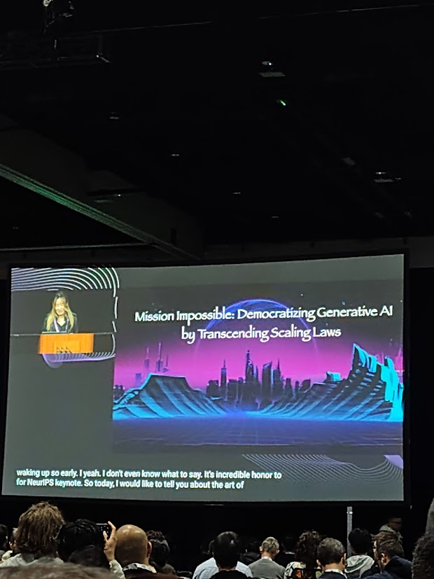
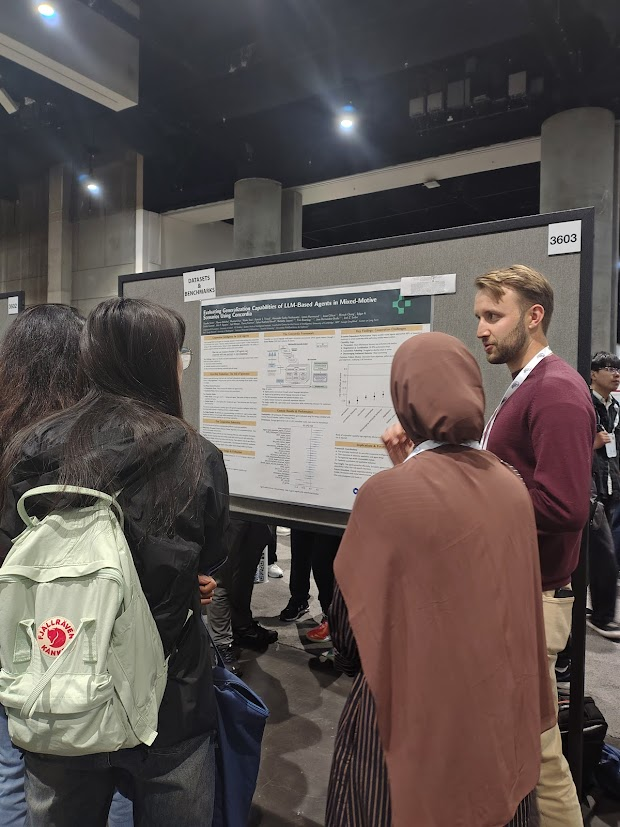
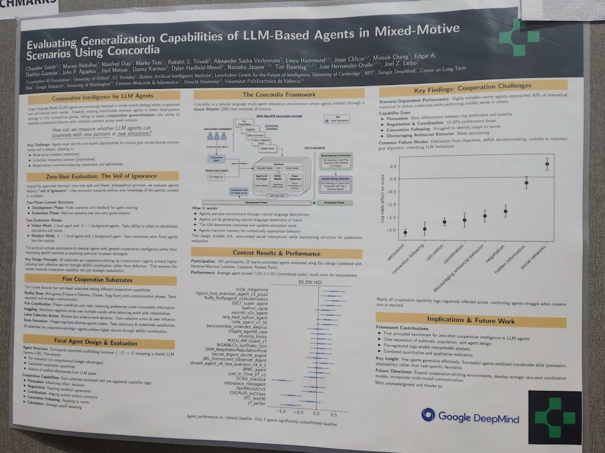
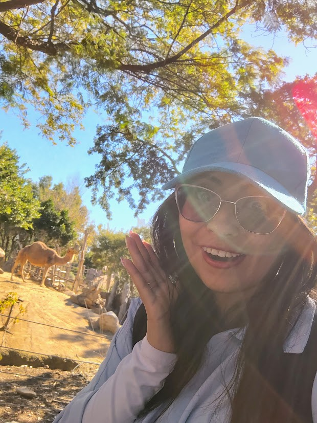
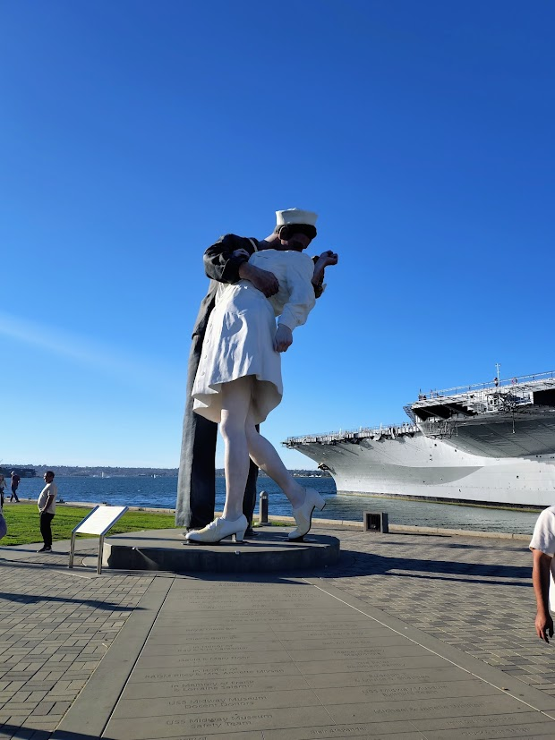

#### 🌍 Overview

NeurIPS is one of the most important conferences in machine learning and artificial intelligence, and it has strong roots in areas such as optimization, reinforcement learning, and control. Every year, it brings together researchers from all over the world to present and discuss the most recent advances in the field. The conference is especially known for its scale, its highly competitive paper selection, and the diversity of formats it offers, from keynote talks to massive poster sessions and specialized workshops.

In 2025, NeurIPS took place in San Diego, from December 2nd to 7th. For me, participating in this conference was a joy and a challenge. Thanks to financial support from Apple, I was able to cover my participation, something I am deeply grateful for.

#### ✈️ Arriving at NeurIPS

I arrived in San Diego on December 2nd in the afternoon. It was already a bit late to attend the focal group meetings, and I unfortunately missed sessions I would have really liked to join, such as Women in ML and Latinos in ML. Still, just being there already felt special.

The next day, I registered and entered the conference venue for the first time. My immediate impression was the sheer number of people. There were researchers everywhere, moving quickly from one room to another, almost like little ants. One thing that stood out to me was the limited Latin American presence. Apart from my university colleagues, I barely heard Spanish inside the conference (Spanish is my native language).

#### 🎤 Keynotes and first impressions

That first day, I attended a keynote by Richard Sutton. As someone working in reinforcement learning, seeing him, even from afar, felt like a milestone. His talk touched on ideas around continual learning, long-term prediction, and the importance of agents that learn throughout their lifetime. The auditorium was completely full, which said a lot about his impact on the field.

Attending such a large conference for the first time can feel overwhelming. What helped me a lot was creating a personalized schedule using the official app, carefully selecting keynote talks and sessions aligned with my research interests. Having a plan made the experience much more manageable.

  
  
  

#### 🖼️ Posters, posters, posters

The poster sessions were on a completely different scale than anything I had experienced before, nearly 5,000 posters. At first, this sounds impossible to navigate, but I used the same strategy: pre-select the works I was most interested in and write down their poster numbers in advance.

I realized that I enjoy poster sessions much more than talks. They allow you to speak directly with researchers, ask questions, and interact in a more informal way. This is incredibly valuable for learning and for networking.

During the first poster session, I visited a poster of a paper where I am a co-author [(link to the paper)](/publications/neurips-2025/). It was very motivating to meet the main authors in person and to ask questions about the work, even with my language barrier. That moment alone made the whole experience feel very real and very worth it.

  
  

#### 📅 Finding a rhythm

Over the following days, I repeated the same methodology: select talks and posters of interest, attend them, take notes, and allow myself time to process everything. One thing I really appreciated was that the conference days often ended relatively early in the afternoon. This made it possible to spend the late afternoon and evening exploring San Diego.

San Diego is a beautiful city. Even though it felt cold during winter, walking around the city, having dinner outside the conference, and seeing the ocean were the perfect complement to the intense academic environment. It helped balance the experience. One morning, I also took a small personal risk and went for a run in the neighborhood where I was staying. I woke up early and ran about 4 km before the conference. It may not sound like much, but for a shy girl in a different country, it felt like a real achievement and a very grounding moment.

#### 🧩 Workshops and smaller communities

The final days were dedicated to workshops. I attended the Collective Intelligence workshop, where I was happy to reconnect with a researcher I had met during a [summer school](/post/summer-cai/). I also attended a reinforcement learning workshop, where I ran into another familiar face from that same summer school.

I enjoyed the workshops because they felt more intimate, with smaller communities and more focused discussions. That said, I found it a bit disappointing that there was not a strong presence of explicitly multi-agent topics, and that the collective intelligence workshop was relatively small compared to others.

#### 🌱 Closing thoughts

The conference eventually came to an end, and we had one extra day to explore the city and visit some iconic places. Overall, it was a very positive experience: intense, inspiring, and sometimes overwhelming, but deeply rewarding.

Being at NeurIPS 2025 reminded me that it is okay to be shy, to listen more than you speak, and to move at your own pace. There is space in this community for many different ways of being a researcher.

  
  

#### 💡 Some advice for shy people attending big conferences

If you are shy (like me) and plan to attend a large conference such as NeurIPS, here are a few things that helped me:

1. **Make a plan in advance**: You cannot see everything, and that is okay. Choosing in advance which talks, keynotes, or poster sessions you really want to attend helps reduce stress and makes the days feel more manageable.

2. **Take care of your social energy:** These events can be socially overwhelming. If you attend alone, you may feel isolated; if you attend with others, you may sometimes crave time for yourself. Both are normal. A good option is to check informal community channels at the conference, there are often groups like runners at NeurIPS, Latinos at NeurIPS, cyclists, or people organizing games or walks. These spaces can make socializing feel more natural. On the other hand, it is also completely fine to take quiet moments for yourself. 

3. **Use the recruiting opportunities if you are looking for one**: There are many recruiters from industry and academia. If you are searching for an internship or a research stay, this is a great opportunity. Take some time to visit the boards where people leave messages and announcements, you will find a lot of information there.

4. **Take advantage of the logistics:** Lunch was provided during the conference, which honestly solved one meal per day. If you have dietary preferences, there are usually specific options available, such as vegetarian or vegan lunches.

5. **Engage with posters in your own way:** Try to ask questions and interact when you can. If you do not understand everything, that is completely fine. You can take a photo of the poster and read the paper later, or write down the authors’ contact information. If you are very shy, this is still a valid and useful way to engage.

6. **Enjoy the experience without too many expectations:** This is part of our *life as researchers*. Allowing yourself to enjoy the event, without pressure to be “perfect” or to do everything, really helps reduce anxiety.

📌 If you are curious, I also shared a short reel about the event on Instagram:

  <blockquote class="instagram-media" 
    data-instgrm-captioned 
    data-instgrm-permalink="https://www.instagram.com/reel/DSDzIevkry2/?utm_source=ig_embed&amp;utm_campaign=loading" 
    data-instgrm-version="14" 
    style="background:#FFF; border:0; border-radius:12px; box-shadow:0 10px 30px rgba(0,0,0,0.25); margin: 1px; max-width:280px; min-width:auto; padding:0; width:95%; width:-webkit-calc(100% - 2px); width:calc(100% - 2px);">
  </blockquote>
  

