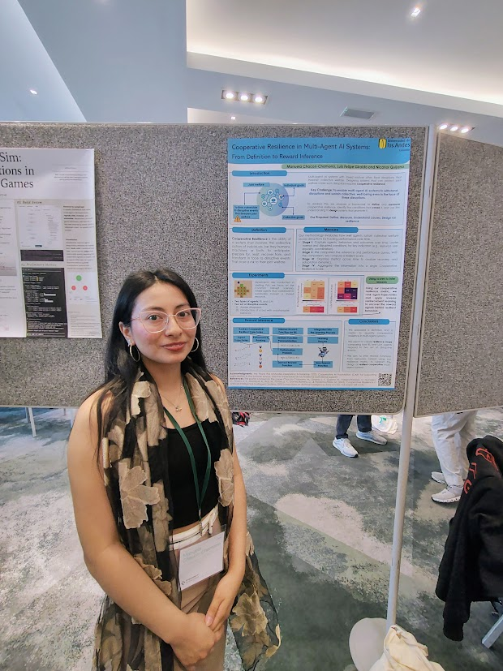

## A week of cooperation, learning, and shared curiosity

#### 🌍 Overview 

This summer, I had the opportunity to attend the Cooperative AI Summer School 2025, organized by the Cooperative AI Foundation. It took place in Marlow, UK — a quiet town surrounded by green landscapes, perfect for a week dedicated to deep discussions about AI, cooperation, and human values. The program combined academic sessions and collaborative activities, structured as:

- Keynote lectures by leading researchers,

- One-to-one meetings and working groups,

- Poster sessions on July 10–11,

- A final hands-on challenge session.

#### 💡 Main themes that inspired me

The school brought together researchers from diverse fields—spanning machine learning, game theory, philosophy, and the social sciences. Despite our different profiles and research agendas, we converged on a shared question:
*How can we build AI systems that cooperate effectively with humans and with each other?*

Talks ranged from the formal foundations of cooperation and mixed-motive games to the social and ethical dimensions of AI. I was especially inspired by sessions on emergent coordination, multi-agent learning under uncertainty, and resilient collective behaviors. The poster session was equally insightful: work on diplomatic games and AI-mediated negotiation—particularly with LLM-based agents—made clear where current AI capabilities are heading and what is at stake.

This trajectory presents both opportunities and risks. It underscores the need to anticipate misalignment behaviors and to advance AI safety by designing systems that incentivize cooperative objectives, align with collective well-being, and support multisector progress across regions.

#### 🧠 Poster Presentation and GIF Competition

During the poster sessions, I presented my work titled “Cooperative Resilience in Multi-Agent AI Systems: From Definition to Reward Inference.” The poster summarized my research agenda, which unfolds in four main stages: defining what resilience means within the scope of Cooperative AI; measuring this property in mixed-motive multi-agent systems; understanding what drives agents to exhibit—or fail to exhibit—resilient behavior, for example by inferring their underlying rewards or motivations from trajectories evaluated with a resilience metric; and finally, using those insights to design agents that encapsulate this property and foster system-level resilience. The first two stages — **definition** and **measurement** — were developed in detail in my [paper on Cooperative Resilience in Multi-Agent AI Systems](/publications/tai-2025/), which lays the theoretical and experimental foundation for this line of research.

  

    
  

  

    
  

  <a class="poster-button" href="poster.pdf" target="_blank">📄 View Full Poster (PDF)</a>

#### 🧩 Final Day — Collaborative Challenge

In the final session, we participated in a hands-on challenge exploring agent properties such as truthfulness and information sharing. Our group proposed an approach to measure truthfulness by analyzing how agents omit relevant information — linking naturally with our ongoing research on cooperative resilience and behavioral inference. This session fostered interdisciplinary collaboration, connecting reinforcement learning, behavioral modeling, and ethics. 

This activity raised deep questions about systems with LLM agents. Truthfulness alone is hard to define—let alone guarantee—and it quickly connects to other, more human-like capacities we may be inadvertently promoting in artificial agents. In particular, the ability to **omit information** is critical: agents might leave things out for strategic, safety-related, or purely accidental reasons. Detecting when omission occurs, and inferring the underlying motivation, becomes a central challenge for evaluation and governance.

#### 🤝 Connecting research and purpose

Beyond the technical depth, what struck me most was the **community**. I met researchers and practitioners working on questions closely aligned with my own, and it was energizing to realize how many people around the world are pursuing similar ideas. I had the chance to speak with several of them—people who share a vision for cooperative, reliable AI—and those conversations were grounding and inspiring. The school fostered an open, reflective atmosphere that blended academic rigor with philosophical curiosity and deeply motivating.

#### 🌱 Looking forward

Attending the Cooperative AI Summer School was a truly inspiring experience, scientifically and personally. It strengthened my understanding of cooperation as a fundamental design principle in AI systems and allowed me to connect with the global Cooperative AI community, sharing ideas, building friendships, and finding common research goals.

I returned from Marlow with new perspectives, collaborations, and reflextions. As I continue my doctoral research, I hope to integrate these insights into frameworks that help agents adapt, sustain fairness, and thrive together under disruption.
