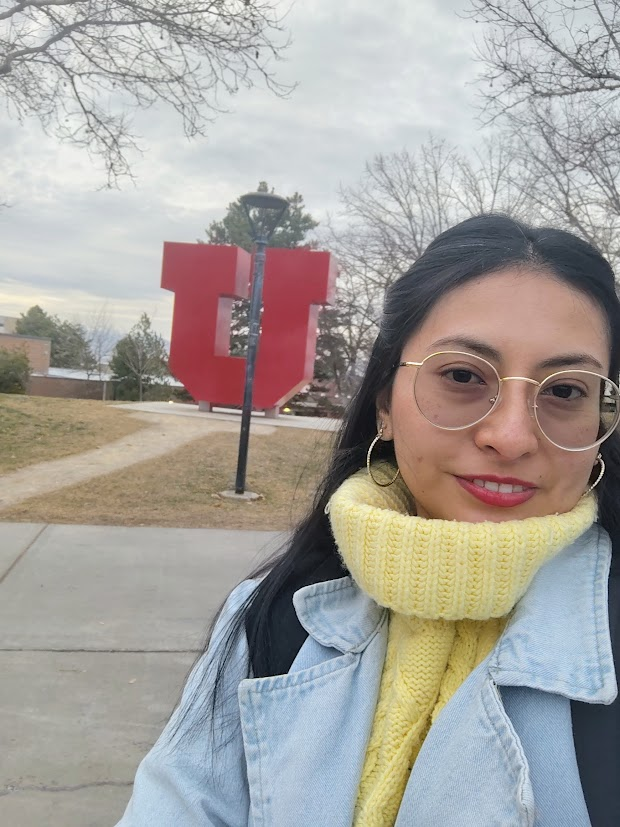
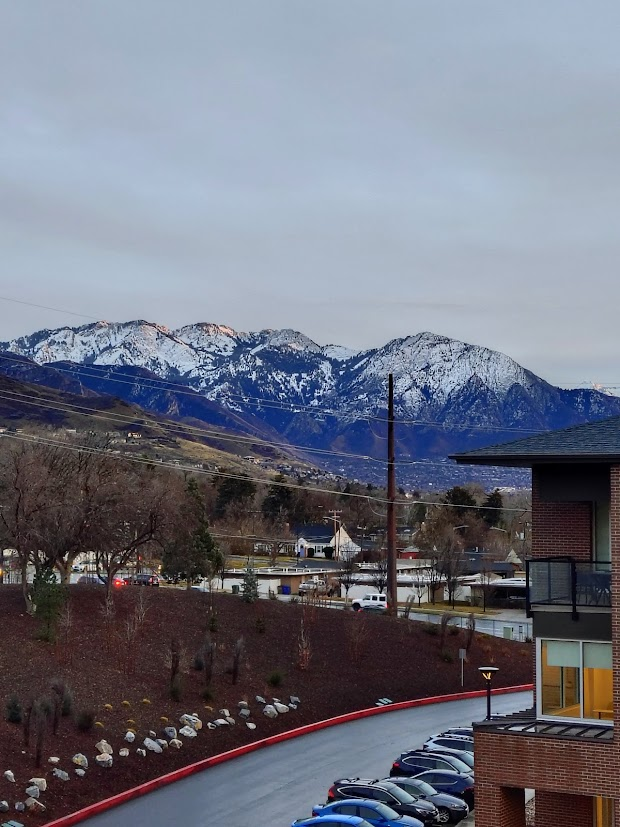
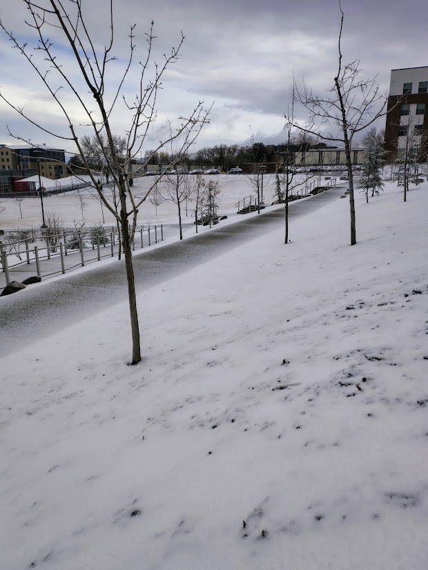
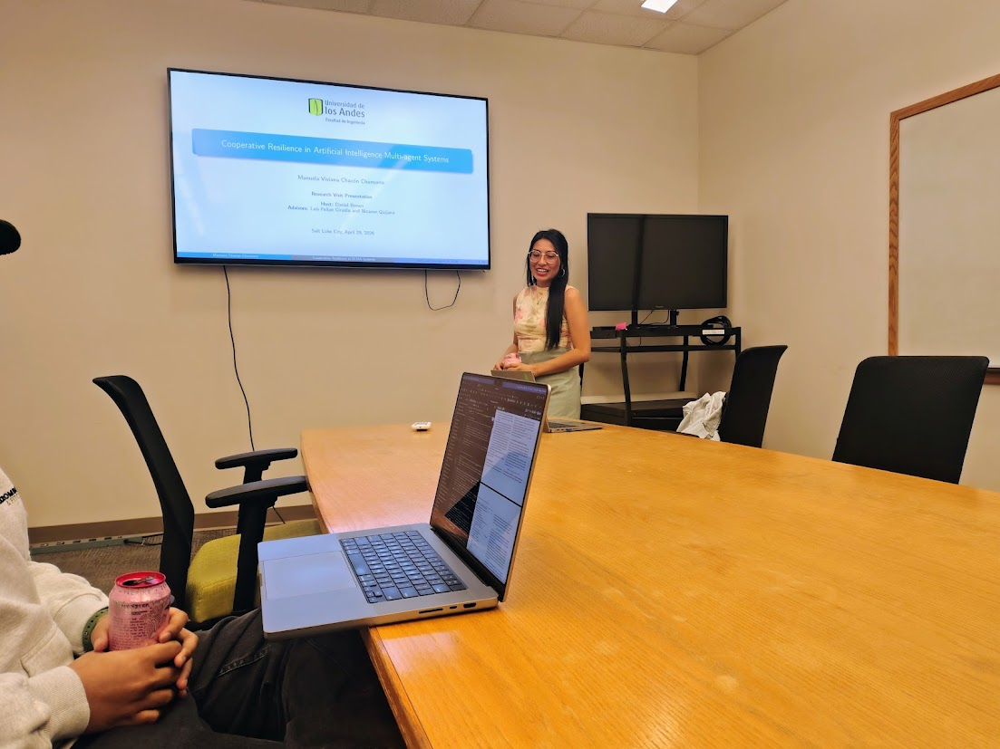
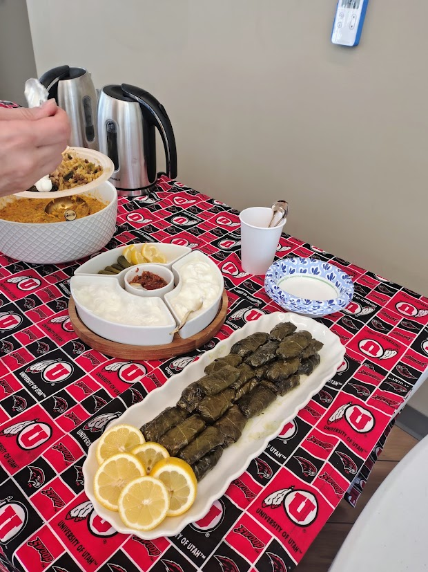
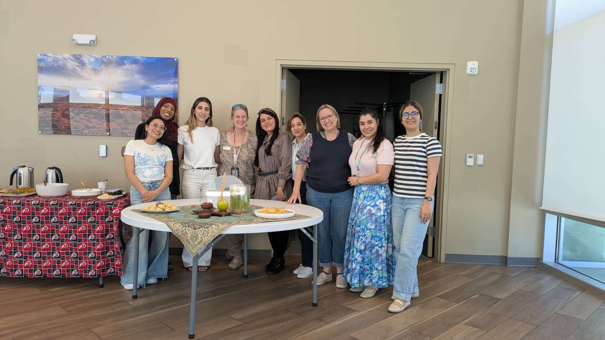
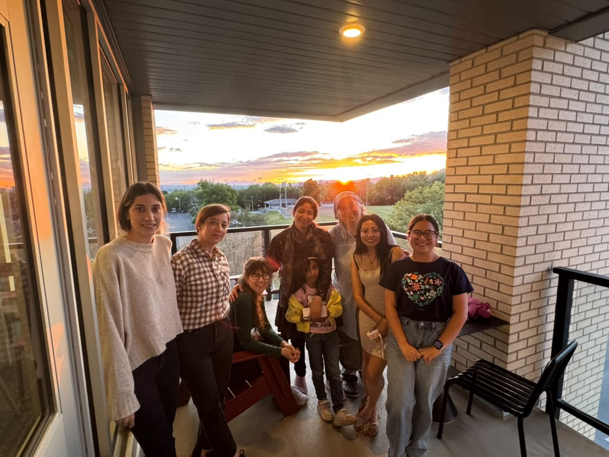
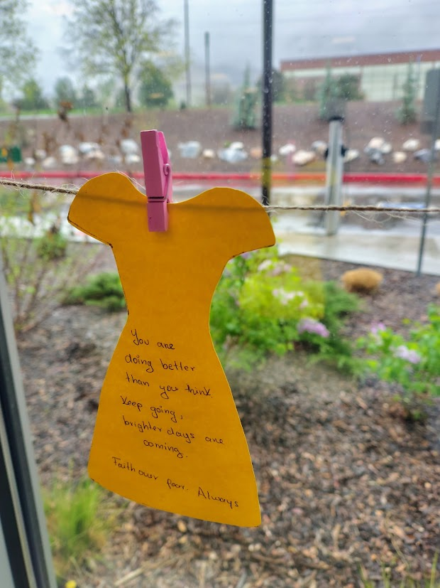
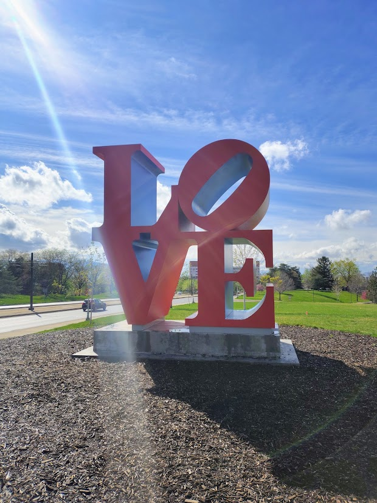
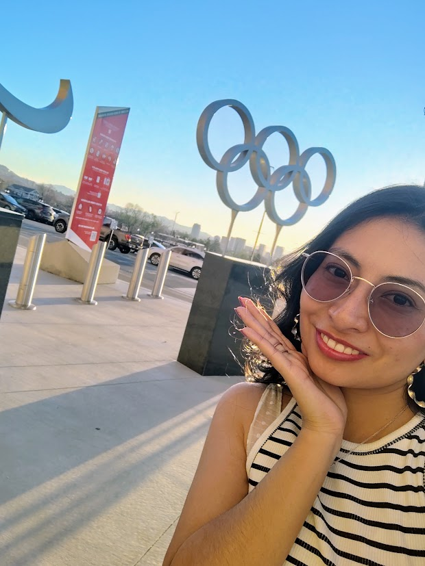

#### 🌎 A research experience abroad

During my doctoral studies, I had the opportunity to complete a research stay at the University of Utah, in the United States. This experience allowed me to work with Professor Daniel S. Brown, learn in a different academic environment, and spend time with people from many different countries.

From a research perspective, the stay was an important opportunity to step outside my usual environment and examine my work from new perspectives. At a personal level, it was also a meaningful challenge: I had to communicate in English every day, adapt to a different culture, and learn how to navigate academic and everyday life in another country.

Looking back, I remember this experience not only because of the research, but also because of the people, the campus, the mountains surrounding Salt Lake City, and the snow. As a Latin American researcher experiencing this landscape for the first time, it felt truly special.

  
  
  

#### 🧠 Working on preference learning in multi-agent reinforcement learning

During the research stay, I worked with Professor Daniel S. Brown on preference learning in multi-agent reinforcement learning.

One of the central questions behind this work was how to design learning signals that encourage desirable collective behavior in multi-agent systems. In mixed-motive environments, agents must often balance their individual objectives with the welfare and long-term functionality of the group. This tension makes reward and incentive design particularly important.

Preference learning provides an alternative to manually specifying every component of a reward function. Instead, information obtained from comparisons or rankings between trajectories can be used to infer which behaviors are more desirable. In my research, this perspective is especially relevant for learning incentives aligned with cooperative resilience: the capacity of a multi-agent system to preserve collective well-being when it experiences disruptions.

Working with Professor Brown gave me the opportunity to discuss these ideas with a researcher whose work has made important contributions to preference-based reinforcement learning. Our conversations helped me think more carefully about reward inference, experimental design, and the connection between human preferences and artificial-agent behavior.

  

#### 🗣️ Communicating in a second language

One of the most difficult aspects of the experience was communicating in English. English is not my first language, and at times I needed additional time to understand conversations, organize my ideas, or find the right words to express a technical point.

At the beginning, this made me feel insecure. I worried about my accent, my grammar, and whether other people would understand what I wanted to say. However, daily interaction gradually helped me become more comfortable.

I learned that successful communication does not require perfect grammar or a native accent. Most people were patient and flexible, and they were usually more interested in understanding the idea than in evaluating how perfectly it was expressed. When something was unclear, I could ask people to repeat it, speak more slowly, or explain it differently.

By the end of the stay, I felt genuinely happy and proud that I had managed to communicate, participate in research discussions, and build connections in another language. My English did not suddenly become perfect, but I became more confident using it. That confidence was one of the most valuable outcomes of the experience.

#### 🏡 Living in an international community

I also had the opportunity to live in the university residences. This became an important part of the experience because it allowed me to meet and spend time with people from different countries and cultural backgrounds.

Daily life in the residences created natural opportunities to talk, share meals, learn about other cultures, and discover how differently people can experience university life. These interactions happened outside formal research meetings, but they contributed enormously to my personal growth.

Living in a multicultural community reminded me that an international research stay is not only about working in a laboratory or attending academic meetings. It is also about learning how other people live, communicate, collaborate, and understand the world.

  
  
  

#### ❄️ The campus, the mountains, and the snow

Some of my strongest memories of Utah are connected to its landscape. The mountains are visible from many parts of the university, and their presence gives the campus a distinctive atmosphere.

I also remember the snow. Coming from Colombia, seeing those landscapes and experiencing winter in Utah was beautiful and unforgettable. Even ordinary walks through the campus could feel special because the surroundings were so different from what I was used to.

Exploring the university and the city helped me create a balance between research and personal life. Those moments gave me time to process the experience, appreciate where I was, and recognize the significance of having reached that point in my doctoral journey.

  
  
  

#### 🌱 What the experience taught me

This research stay taught me that academic growth often happens together with personal growth. Learning new methods and discussing research were essential parts of the experience, but so were navigating another culture, communicating despite uncertainty, and becoming more independent.

It also reminded me that feeling nervous or out of place at the beginning does not mean that we are not prepared for an international experience. Sometimes confidence appears only after we begin: after the first difficult conversation, the first meeting in another language, or the first time we manage to solve an everyday problem by ourselves.

I returned with new research ideas, greater confidence, and a deeper appreciation for international and interdisciplinary collaboration. I also returned with memories of the people I met, the university residences, the campus, the snow, and the mountains of Utah.

#### 💡 Advice for shy Latin American researchers abroad

If you are shy, speak English as a second language, or are preparing for your first research stay abroad, these are some lessons that helped me:

1. **Speak even if your English is not perfect.** You do not need a native accent or perfect grammar to contribute valuable ideas. Speaking is also how fluency and confidence develop in practice.

2. **Ask for clarification when you need it.** It is completely acceptable to ask someone to repeat a sentence, speak more slowly, or explain an unfamiliar expression. Pretending to understand usually creates more difficulty than asking a simple question.

3. **Participate in the multicultural life of the university.** If you live or study in a place with people from many countries, take the opportunity to meet them. Informal conversations and shared activities can become some of the most memorable parts of the experience.

4. **Create small opportunities to interact.** You do not need to attend every social event or speak with everyone. Having lunch with a colleague, joining a campus activity, or starting a short conversation can be enough to gradually feel part of the community.

5. **Ask questions and share your ideas in research meetings.** Shyness can make us wait until an idea feels completely finished. However, research discussions are precisely the place where incomplete ideas can be examined and improved.

6. **Explore the campus and the city.** A research stay is also a cultural and personal experience. Walk around, visit meaningful places, observe daily life, and allow yourself to enjoy the environment beyond the office.

7. **Be patient with yourself.** Adapting to another language, culture, and academic system takes time. Feeling tired, homesick, or insecure does not mean that the experience is going badly.

8. **Document the experience.** Take photographs, write short notes, and record the small moments. With time, these details may become as meaningful as the formal academic achievements.

#### 💭 Closing thoughts

My research stay at the University of Utah was academically valuable and personally unforgettable. It challenged me to communicate in a second language, participate in a new research environment, and live in a multicultural community.

Most importantly, it showed me that being shy or not speaking perfect English does not prevent us from taking part in international research. We can learn, contribute, communicate, and build meaningful connections while still being ourselves.

Sometimes the first step is simply accepting that we do not need to feel completely ready before beginning.